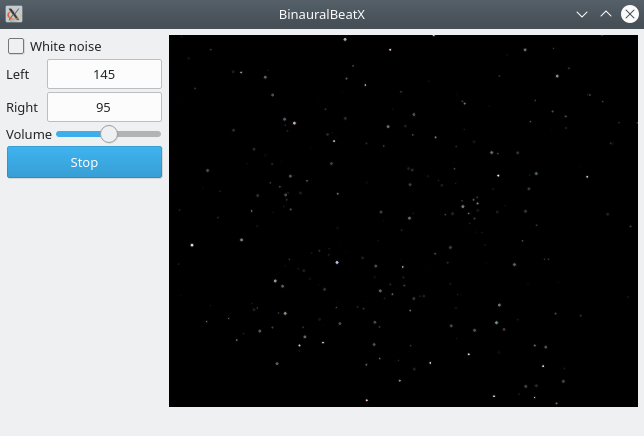

BinauralBeatX - binaural beats experimentation.

License: GPL-3 (GPL-3.0-only)  
Source code: https://github.com/dualword/binauralbeatx  

    

# Disclaimer

- **Not a medical device** This software provides content designed **solely** for **informational, educational, research, and experimental purposes**. It does not provide medical advice and is not intended to diagnose, treat, cure, or prevent any medical condition. Always consult a qualified healthcare professional before making any health-related decisions.

- **Operational Safety Warning** Do not use this application while driving or while performing any task that requires your undivided attention.

- **High-Risk preexisting health conditions** If you have a history of seizures, epilepsy, mental health conditions, auditory disorders, **any implanted medical device**, or are pregnant, do not use this application without first consulting your physician. Discontinue use immediately if you experience **any adverse symptoms**.
 
- **Hearing protection** To protect your hearing, avoid listening to these audio at high or maximum volumes for extended periods.

- **Limitation of Liability:** The **Application** is provided **"as is"** without any warranties of accuracy, completeness, or suitability for a particular purpose. The use of this **Application** does not imply endorsement by any institution, regulatory body, or healthcare provider. The authors and contributors of this repository are not liable for any direct, indirect, incidental, special, or consequential damages arising from the use or misuse of the **Application**, including but not limited to code, data, or software. The **Application** has **not been validated or approved for medical diagnosis or treatment**. Use at your own risk.
